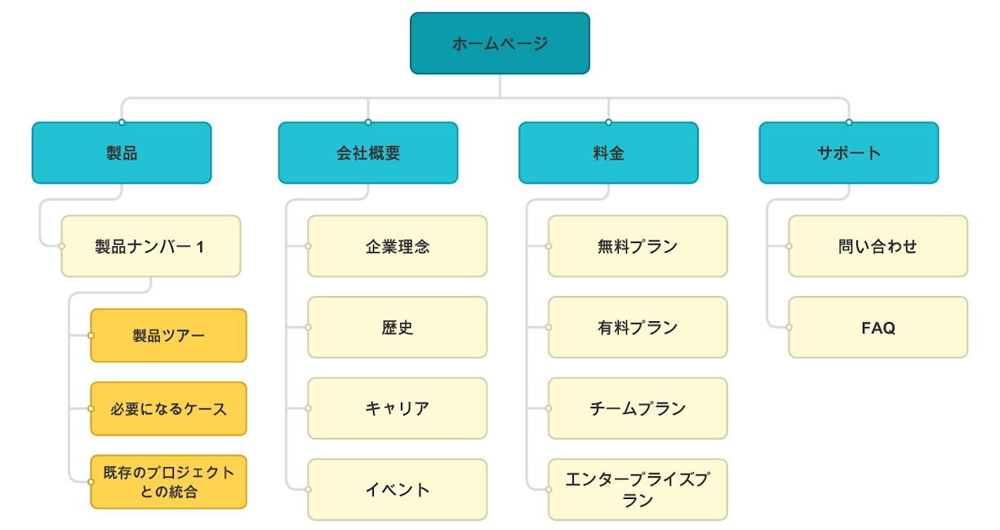

import Material from '../../../../components/utils/material.astro';

## サイトマップとは？

Web サイトを作るときに、サイトマップを作成することは非常に重要です。サイトマップとは、**Web サイトの構造を表す図**のことで、まるで家を建てる前の設計図のようなものです。 これによって、Web サイト上でどのページが存在し、それぞれのページがどのように繋がっているのかを示します。サイトマップがあることで、訪問者は迷うことなく、必要な情報へとスムーズにアクセスできます。

	

## サイトマップの役割

サイトマップは訪問者だけでなく、Web サイトを作る側にとっても多くのメリットがあります。

- **計画性の向上**
  事前にサイトマップを作成しておくことで、Web サイト全体の計画を立てやすくなります。どのページにどのような情報を載せるのか、訪問者がどう動くかを事前に想定できるため、効率的な Web サイト作りが可能になります。

- **ユーザー体験の改善**
  サイトマップは訪問者が求める情報へと直感的にナビゲートするためのガイドとなります。訪問者が迷うことなく情報を得られる構造は、満足度の高いウェブ体験に直結します。

- **検索エンジン最適化（SEO）のサポート**
  例えば、あなたがどこかの会社が出している製品について気になって Google で検索したとしましょう。 そこであなたは『(会社名)＿製品』と検索したにも関わらず、その会社の製品ページへの直接のリンクが表示されずにトップページへのリンクしか表示されなかったら、わざわざそのサイト内で探すことになってしまい手間がかかりますよね。

	<Material
		artist={{
			name: '822640',
			link: 'https://pixabay.com/users/822640-822640/?utm_source=link-attribution&utm_medium=referral&utm_campaign=image&utm_content=1828079',
		}}
	>
		
	</Material>

## サイトマップの具体的な作成手順

サイトマップを作成する際のステップは以下の通りです。

1. **主要ページの洗い出し**
   まずは Web サイトに必要な主要ページをリストアップします。例えば、ホームページ、商品紹介ページ、会社概要ページ、お問い合わせページなどです。

2. **ページ間のリンク構造の決定**
   主要ページを決めたら、それらがどのように相互にリンクするかを考えます。どのページが入口となり、どのページへと導くべきかを明確にします。

3. **各ページのコンテンツの概要決定**
   各ページにどのような情報を載せるかを決めます。訪問者はあなたの Web サイトをゆっくり回る時間はありません。そのため、価値のある情報に絞ることが重要です。

4. **図式化**
   上記の情報を基に、サイトマップを図式化します。これは私が[Slickplan](https://slickplan.com/)というツールを用い制作します。このページの上部にあるサイトマップの画像もこのツールを使い作成しました。

5. **評価と調整**
   完成したサイトマップを見て、一つのページにリンクが集中しすぎていないか、訪問者が混乱しないように出来ているかを検討し、適宜修正します。

6. **定期的な更新**
   Web サイトの更新や拡張が行われるたびに、サイトマップもそれに合わせて更新します。

## まとめ

サイトマップの作成は Web サイト開発の初期段階で非常に重要なプロセスです。ここでは、サイトマップが持つ役割や具体的な作成手順を紹介しました。

サイトマップは、Web サイトの訪問者がスムーズに情報を見つけられるようにナビゲートする役割を持ちます。

サイトマップは以下の利点を提供します。

- 訪問者と検索エンジンに対して、Web サイトの構造を明確に示します。
- どのページにどの情報を載せるかの計画を容易にし、ユーザー体験を向上させます。
- 検索結果でのサイトの見つけやすさを改善します。

作成手順としては、主要ページの洗い出しから始め、ページ間のリンク構造を決め、コンテンツの概要を定め、図式化して評価・調整を行い、最終的には定期的に更新することが挙げられます。

サイトマップは訪問者にとっての道しるべであり、作り手側にとっての計画ツールであるため、その作成とメンテナンスには十分な注意を払い、サイトの成長とともに常に最新の状態に保つことが重要です。
