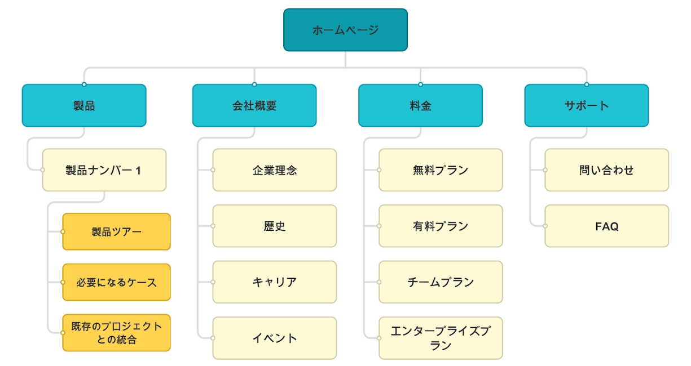
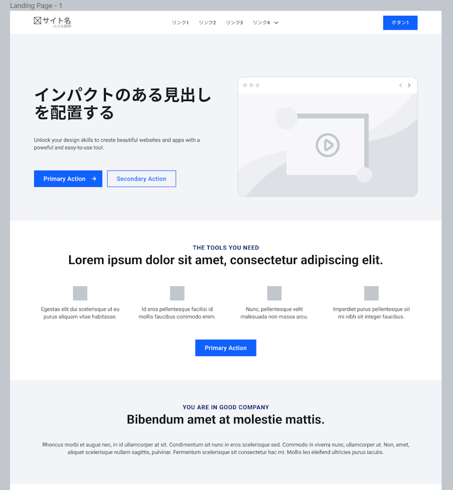
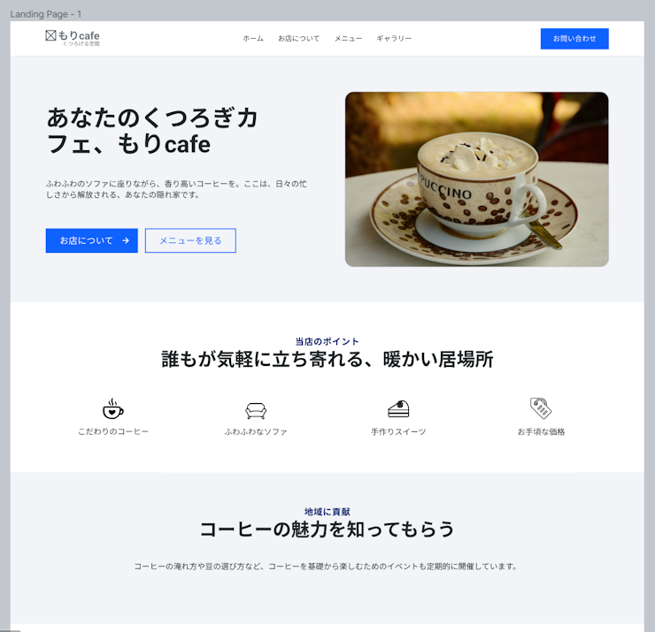
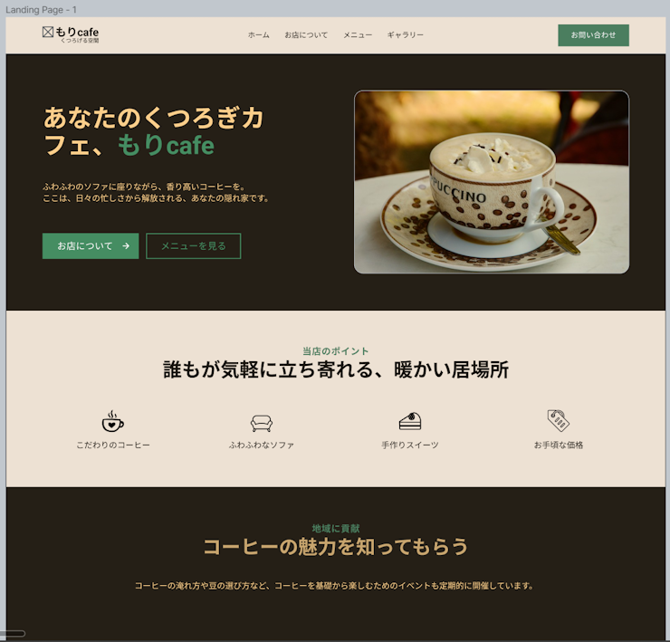
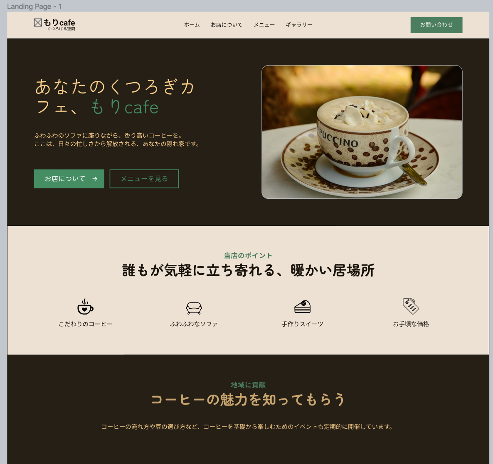
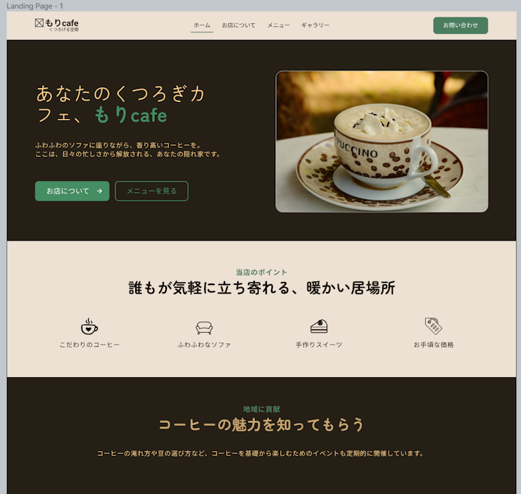
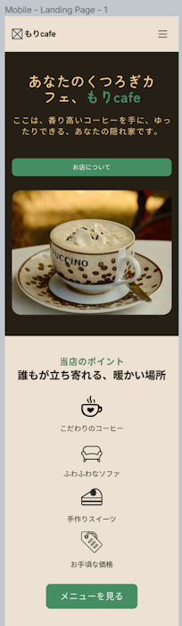

私が以下に提案する方法は、最小限の作業でありながら効果的なアプローチであると考えています。また、重要度の高いことから決めていき、こだわりたい部分を後半にすることで、そこに対して時間を多く使うことができます。

## 1. ターゲットの特定

Web サイトに訪れてくるであろう人はどのような世代であったり、何を目的としているのかについて調べます。例えば、お年寄りの方を対象としている場合は、色のコントラストははっきりとしていて、文字は大きい方がいいですよね。また、女性好みに寄せるのを目的としたら、可愛くて親しみのある雰囲気にしたり、男性好みの場合は、スタイリッシュでカッコいいのにすると最終的に出来上がるのも随分と変わりますよね。

## 2. サイトマップの作成

これはどのようなページが必要になるのかを検討したり、また、各ページの主要な章やページを概説することで、論理的な流れを確保し、ナビゲーションを助けます。 
具体的には、以下の画像のように実際に視覚化しながら進めていきます。

## 3. コンテンツの計画

実際に Web サイトに載せるコンテンツを具体的に決定します。訪問者が必要としている情報がすぐに出てきたらストレスを与えることなく、他のページにも移動してくれるかもしれません。 実際に表示するコンテンツの内容はレイアウトによって多少異なってくるかもしれませんが、伝えたい内容の核となる部分をあらかじめ決めておくことで軸をぶらすことがなくなります。

## 4. レイアウトの決定

Web サイト上でのコンテンツの視覚的な配置に焦点を当てます。具体的にはワイヤーフレーム（Web サイトの骨組み）を用いて、テキスト、画像、その他の要素を魅力的で訪問者に親切な方法で表示する方法を選択します。
具体的には、まず、3 で決めた情報をどのように配置するかを決めます。そして、プレースホルダーを用いておおよその見た目を作ります。
ワイヤーフレームは単なるサンプル画像のようなものですが、実際の Web サイトも同時並行して進めていきますのでご安心ください。

そして、3 で決定したコンテンツをその中に入れていきます。この時に、レイアウトの観点からコンテンツがもう少し長かったり短かったりした方がよいと感じたら適宜修正を加えます。

## 5. 色の決定

Web サイトの色彩計画は重要で、トーンの設定と視覚的魅力に寄与します。選択された色は、ブランドと一貫性があり、その色を見たら訪問者がブランドを思い浮かべてくれたら嬉しいですよね。例えば、マクドナルドと聞いたら、派手な赤と黄を思い浮かべる方が多いと思います。 
以下のサンプルでは、カフェのイメージである茶色をメインに使いつつ、ブランドカラーである緑色をアクセントカラーにしています。

## 6. フォントの決定

Web サイトのフォントを正しく選択することで、テキストが読みやすく、全体的な美的感覚に沿ったものになります。異なるフォントは、異なるムードやメッセージを伝えることができます。

## 7. 仕上げ

最終ステップでは、Web サイトを見直し、磨きをかけます。これには、スマホなどへのさまざまなデバイスへの最適化やデザインの微調整が含まれます。 
下の画像では、前の段階のものと比較して、現在のページのリンクの下に下線を引くようにしたり、長くなる文字の間隔を広めたり、ボタンの角を丸めたりしています。 
また、モバイルデバイスでの最適化では、いくつかのボタンを消したり、レイアウトに合わせて文字を修正したり、ナビゲーションをメニューアイコンを押したら開いたりするようにしたりしています。

## まとめ

このようなステップバイステップのアプローチを取ることで、開発する側と依頼する側でのコミュニケーションを透明化します。これにより、最も重要である訪問者の体験も確実に向上させることができ、全体として一貫した、高品質な Web サイトの制作へと導きます。
